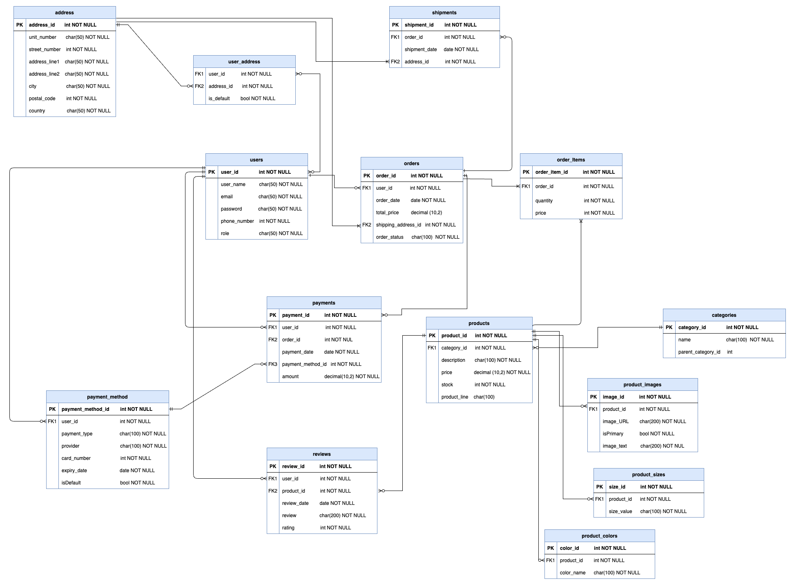

# Fullstack Project: E-commerce system


# 🥿 SmartFeet - Backend API

## Introduction

The SmartFeet backend is a robust and scalable REST API built with C# and .NET Core. This project follows a clean architecture approach with distinct layers, ensuring easy maintenance and scalability. It supports JWT token authentication and utilizes PostgreSQL as its database, hosted on Azure.

[Live link](https://smartfeet-cycudccehyfnf4cy.canadacentral-01.azurewebsites.net/swagger/index.html)

[Frontend link](https://smartfeet-ceeb7.web.app/)

[Frontend repo link](https://github.com/sanisaha/fs18_CSharp_FullStack_Backend)

---

## Table of Contents

- [📖 Introduction](#introduction)
- [🌟 Features](#features)
- [🛠️ Tech Stack](#tech-stack)
- [📂 Project Structure](#project-structure)
- [🚀 Getting Started](#getting-started)
- [🔍 Testing](#testing)

## Features

- **CRUD Operations**: Base service for common CRUD operations for User, Product, Cart, Order, and Payment management.
- **Well-Structured Architecture**: Follows Domain-Driven Design (DDD) principles with separate layers for Domain, Service, Presentation, and Infrastructure.
- **PostgreSQL Database**: Efficient database management with Entity Framework Core and PostgreSQL.
- **Security**: Secure password hashing, with authentication and authorization policies for API requests.
- **Authentication**: Supports authentication via email and password, as well as Google authentication. Tokens are generated using JWT (JSON Web Token) for secure session management.
- **Custom Error Handling Middleware**: Centralized error management for cleaner code and easier debugging.
- **Swagger Integration**: Customized Swagger documentation for API endpoints.
- **Unit Testing**: xUnit tests implemented for Domain and Service layers to ensure robustness.

---

## 🛠️ Tech Stack

- **Backend:**
  - C# & .NET Core
  - Entity Framework Core
  - PostgreSQL
- **Authentication:**
  - JWT Token Authentication
- **Testing:**
  - xUnit for unit testing
- **Deployment:**
  - Azure (Deployed via Azure CLI)

---

## Project Structure

```plaintext
├── Ecommerce.Presentation
│   ├── src
│   │   ├── Controllers
│   │   └── Middleware
├── Ecommerce.Infrastructure
│   ├── Migrations
│   ├── Properties
│   ├── src
│   │   ├── Repository
│   │   └── Database
├── Ecommerce.Service
│   ├── src
│   │   ├── UserService
│   │   ├── OrderService
│   │   ├── ...
│   │   └── Shared
├── Ecommerce.Domain
│   ├── src
│   │   ├── Auth
│   │   ├── Entities
│   │   ├── Exceptions
│   │   ├── Interfaces
│   │   ├── Model
│   │   └── Shared
├── Ecommerce.Tests
│   ├── src
│   │   ├── Domain
│   │   └── Service
└── README.md
```

The project is organized into the following layers:

1. **Domain**: The domain layer contains the core entities and interfaces of the application.
2. **Service**: Contains service classes that handle business rules, logic, and validation.
3. **Infrastructure**: Contains data access logic using Entity Framework Core and manages PostgreSQL interactions. Also has services for password hashing and generate token through JWT authentication.
4. **Presentation**: Contains the API controllers to handle HTTP requests and responses.

An ERD diagram describes the database structure and relationships between entities.


## Getting Started

### Prerequisites

- [.NET 8 SDK](https://dotnet.microsoft.com/download/dotnet/8.0)
- [Local PostgresSQL](https://www.postgresql.org/download/)

### Installation

1. _Clone the repository_:

   ```sh
   git clone https://github.com/sanisaha/fs18_CSharp_FullStack_Backend
   ```

2. _Navigate to the project directory_:

```
cd Ecommerce
```

3. _Restore dependencies_:

```
dotnet restore
```

**Set up the database**:

4. _Create a `appsettings.json` file in `Ecommerce.Infrastructure` folder_:

_add the connection string and jwt credentials_

```
{
  "Logging": {
    "LogLevel": {
      "Default": "Information",
      "Microsoft.AspNetCore": "Warning"
    }
  },
  "AllowedHosts": "*",
  "ConnectionStrings": {
    "localhost": "Host=localhost;Username=<your database username>;Password=<your database password>;Database=ecommerce"
  },
  "Jwt": {
    "Key": "uqgffdqvfyqbwkjnqujfdqkbygkbcbcyqbcybwqcbcby",
    "Issuer": "smart_feet"
  }
}
```

5. _Update the local database_:

   ```sh
   dotnet ef database update
   ```

6. **Run the application**:

   ```sh
   cd Infrastructure
   dotnet run
   ```

_When creating a new product, the `subcategoryId` is required_

##### To fetch subcategories for a specific category (e.g., Men), you can send an API request to the following endpoint:

```bash
GET /api/v1/Category/categoryName/Men
```

## Testing

The test layer includes unit tests that verify the correctness and functionality of the application.
Run tests:

```
dotnet test
```

```

```
